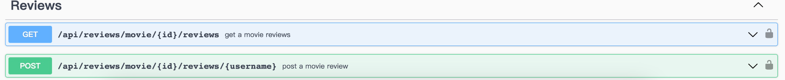

# Assignment 2 - Web API.

Name: Shaobo Zang

## Features.

 + More API routes with parameterized URLs. 
 + Authentication service.
 + All APIs used by the frontend are now processed by the backend.
 + More protected pages.
 + Using swagger to document APIs.
 + Data are now stored in MongoDB.

## Setup requirements.

`npm install`  

## API Configuration

 + create `.env` file in the movies-api folder:
    ______________________
    NODE_ENV=development  
    PORT=8080   
    HOST=localhost  
    MONGO_DB=YourMongoURL  
    SEED_DB=True  
    SECRET=YourJWTSecret  
    REACT_APP_TMDB_KEY=YourTMDBApiKey  
    ______________________

## API Design  

](image/image3.png)

### [Movies](movies-api/api/movies/index.js)  
+ /api/movies/tmdb/discover/page:page | GET | get a homepage movielist
+ /api/movies/tmdb/upcoming/page:page | GET | get a upcomming movielist
+ /api/movies/tmdb/movie/:id | GET | get a single movie detail
+ /api/movies/tmdb/movie/:id/images | GET | get a single movie image.  
+ /api/movies/tmdb/movie/:id/movie_credits | GET | get a single movie's credits.  

### [Actors](movies-api/api/actors/index.js)  
+ /api/people/tmdb/popular/page:page | GET | get popular actors page.  
+ /api/people/tmdb/person/:id/movie_credits | GET | get a single person's movie credits.  

### [Reviews](movies-api/api/reviews/index.js)    
+ /api/reviews/movie/:id/reviews | GET |  
+ /api/reviews/movie/:id/reviews/:username | POST |  

### [Users](movies-api/api/users/index.js)  
+ /api/users/ | POST | Register
+ /api/users/:id | Put | Update
+ /api/users/:userName/favourites | POST | 
+ /api/users/:userName/favourites | GET | 

## Security and Authentication

JWT Authentication is utilized by the application to manage user sessions for crucial user functions such as favorites and reviews.  

## Integrating with React App

Integrated React app to use all data taken from the API within movies, tvshows, actors...

## Independent learning (if relevant)

API creating / Swagger document 